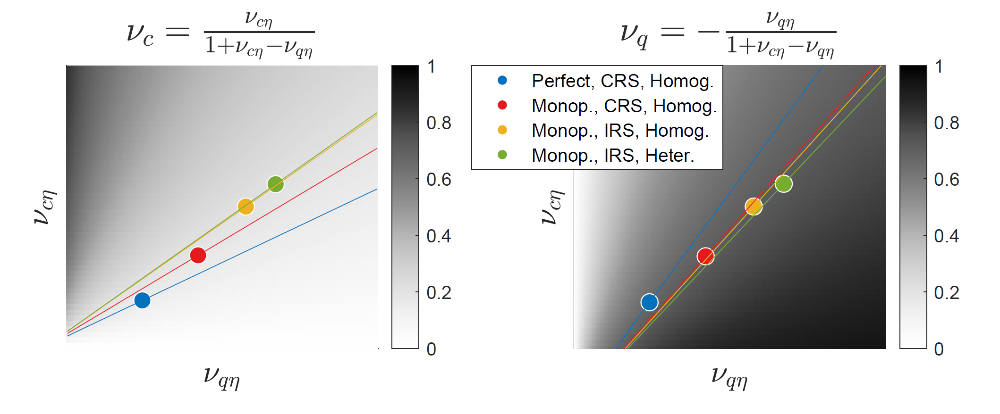

How important are terms-of-trade shocks relative to total-factor-productivity shocks as a source of consumption volatility in commodity-exporting economies? We develop a tractable version of Gopinath & Neiman (2014) with segmented financial markets and realistic real exchange rate determination and provide a bridge to the more traditional frictionless model. We have two main results. First, we show how the differences between the models are captured by two partial elasticities for which we provide analytical expressions. Second, we show that a combination of these two partial elasticities determines the relative importance of terms-of-trade shocks relative to productivity shocks, independent of assumptions on market structure, returns to scale to importing, selection into importing, and financial markets.

We calibrate the economy to Chilean and Colombian micro and macro data to show that the terms of trade are at least two times more important than in the standard frictionless small-open economy (SOE) framework: thirty-four percent of this difference is accounted for by monopolistic competition, sixty-two by increasing returns to importing, and only four percent by firm heterogeneity and selection. However, we show that the latter are crucial in capturing moments of the microdata such as the slope of the sub-intensive margin of trade adjustment and the distribution of imports.